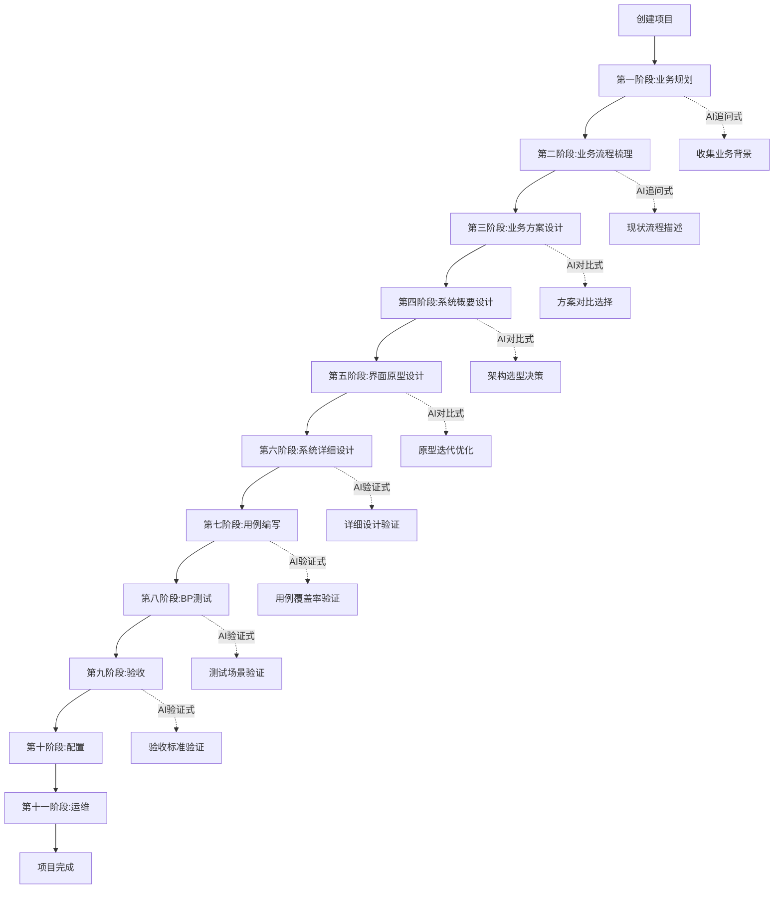
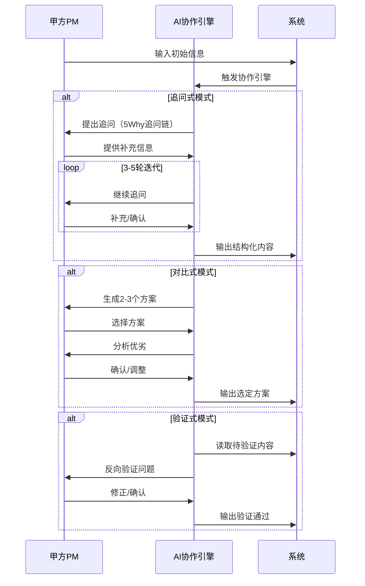

# 甲方产品经理自动化工作流操作台 - 产品需求文档

## 1. 产品概述

**甲方产品经理工作流智能协作平台**，帮助甲方PM从模糊业务诉求到可交付系统的完整生命周期管理。AI在每个阶段扮演"思考加速器+验证器"角色，通过追问式、对比式、验证式三种协作模式，大幅提升需求质量和交付效率。

### 产品定位
- 面向人群：甲方企业产品经理、项目负责人、业务负责人
- 核心价值：规范化需求输出、缩短与乙方的沟通成本、确保交付质量
- 市场价值：在数字化转型大背景下，甲方对数字化系统建设的能力需求日益增长

---

## 2. 核心功能

### 2.1 用户角色

| 角色 | 权限范围 | 核心功能 |
|------|---------|---------|
| 项目管理员 | 全项目权限 | 创建项目、管理成员、审批文档、查看所有阶段 |
| 项目成员 | 当前项目权限 | 参与工作流各阶段填写、编辑、查看 |
| 访客 | 只读权限 | 查看已确认的文档和输出物 |

### 2.2 功能模块架构

```
甲方PM工作流操作台
├── 工作流管理（11个阶段）
│   ├── 第一阶段：业务规划
│   ├── 第二阶段：业务流程梳理
│   ├── 第三阶段：业务方案设计
│   ├── 第四阶段：系统概要设计
│   ├── 第五阶段：界面原型设计
│   ├── 第六阶段：系统详细设计
│   ├── 第七阶段：用例编写
│   ├── 第八阶段：BP测试
│   ├── 第九阶段：验收
│   ├── 第十阶段：配置
│   └── 第十一阶段：运维
├── AI协作引擎
│   ├── 追问式对话
│   ├── 对比式方案生成
│   └── 验证式检查
├── 文档中心
│   ├── 文档模板库
│   ├── 项目文档库
│   └── 输出物管理
├── 项目看板
│   ├── 阶段进度追踪
│   ├── 任务分配与跟踪
│   └── 里程碑管理
└── 个人工作台
    ├── 待办事项
    ├── 消息通知
    └── 快捷入口
```

---

## 3. 核心页面详情

### 3.1 首页/工作台

| 模块名称 | 功能描述 |
|---------|---------|
| 欢迎卡片 | 显示用户名、今日任务数、当前项目状态 |
| 进行中的项目 | 卡片展示：项目名称、当前阶段、进度百分比、最近活动时间 |
| 待办事项列表 | AI生成的任务清单，支持勾选完成 |
| 快捷入口 | 跳转至：新建项目、文档模板、常用阶段 |
| 最近文档 | 最近编辑的文档列表 |

### 3.2 项目总览页

| 模块名称 | 功能描述 |
|---------|---------|
| 项目信息卡片 | 项目名称、描述、创建时间、状态标签 |
| 阶段进度条 | 11个阶段的横向进度展示，当前阶段高亮 |
| 阶段卡片列表 | 每个阶段的详细状态：未开始/进行中/已完成/待确认 |
| 阶段详情面板 | 点击阶段展开：当前内容预览、AI对话入口、文档列表 |
| 项目成员列表 | 头像+角色+最后活跃时间 |

### 3.3 各阶段通用页面结构

每个阶段页面包含以下模块：

| 模块名称 | 功能描述 |
|---------|---------|
| 阶段指引 | 当前阶段的AI协作说明、操作步骤 |
| 内容编辑区 | 富文本编辑，支持Markdown |
| AI对话区 | 追问式对话界面，实时交互 |
| 方案对比区 | 对比式模式下的多方案展示（可选） |
| 验证结果区 | 验证式检查结果展示 |
| 文档生成区 | 自动生成结构化文档预览 |
| 历史版本区 | 版本对比与回退 |

### 3.4 AI协作对话界面

| 模块名称 | 功能描述 |
|---------|---------|
| 对话模式切换 | 追问式/对比式/验证式 三种模式切换 |
| 对话历史 | 追问链的完整记录，可折叠查看 |
| AI追问气泡 | 追问内容高亮显示，分类标签（根因/异常/边界） |
| 用户回复输入 | 支持文字、图片、文件上传 |
| 智能提示 | 基于上下文的AI回复建议 |
| 意图识别标签 | AI自动识别的意图：SMART目标/范围边界/异常场景等 |

### 3.5 文档中心

| 模块名称 | 功能描述 |
|---------|---------|
| 模板库 | 11个阶段的输出物模板，可预览和套用 |
| 我的文档 | 按项目分类的所有文档列表 |
| 文档编辑器 | 集成Markdown编辑器，支持插入模板块 |
| 文档版本 | 版本历史对比、差异高亮 |
| 导出功能 | 支持导出：Word、PDF、Markdown |

### 3.6 项目看板

| 模块名称 | 功能描述 |
|---------|---------|
| 看板视图 | 拖拽式任务看板，列=阶段，任务卡片展示详情 |
| 时间线视图 | 甘特图展示各阶段计划时间与实际进度 |
| 里程碑视图 | 关键节点标记与状态追踪 |
| 统计分析 | 各阶段耗时、用AI对话轮次、文档产出量 |

---

## 4. 核心业务流程

### 4.1 完整工作流主流程



### 4.2 AI协作核心流程



---

## 5. 用户界面设计

### 5.1 设计风格

**设计理念：专业高效的企业工具 + 智能协作的未来感**

| 设计维度 | 方案选择 |
|---------|---------|
| 整体风格 | 科技感企业级设计，强调结构清晰与信息层次 |
| 配色方案 | 主色：深蓝 #1a1f36（信任/专业），辅助：青蓝 #00d4aa（智能/创新），强调：琥珀 #f59e0b（提醒/进行中），成功：翠绿 #10b981，完成状态 |
| 按钮风格 | 圆角矩形6px，主按钮实心，次按钮描边，文字按钮透明 |
| 字体 | 标题：思源黑体 Bold/Medium，正文：Inter/Noto Sans SC |
| 布局风格 | 左侧导航+右侧内容区，卡片式模块组合 |
| 图标风格 | Lucide图标库，线性风格，2px描边 |
| 动效 | 阶段切换滑入滑出，AI对话气泡渐显，任务完成打勾动画 |

### 5.2 页面色彩规范

| 用途 | 颜色代码 |
|------|---------|
| 主背景 | #0f1219（深色）/ #f8fafc（浅色） |
| 卡片背景 | #1a1f36（深色）/ #ffffff（浅色） |
| 主色调 | #00d4aa（智能青蓝） |
| 辅助色 | #6366f1（靛蓝） |
| 警告色 | #f59e0b（琥珀） |
| 成功色 | #10b981（翠绿） |
| 文字主色 | #e2e8f0（深色）/ #1e293b（浅色） |
| 文字次要 | #94a3b8 |

### 5.3 阶段视觉设计

每个阶段采用独特的视觉标识：

| 阶段 | 主题色 | 图标 | 进度环颜色 |
|------|-------|------|-----------|
| 业务规划 | #8b5cf6 紫 | Target | 紫色渐变 |
| 流程梳理 | #06b6d4 青 | GitBranch | 青色渐变 |
| 方案设计 | #f59e0b 琥珀 | FileText | 琥珀渐变 |
| 概要设计 | #3b82f6 蓝 | Layers | 蓝色渐变 |
| 原型设计 | #ec4899 粉 | Layout | 粉色渐变 |
| 详细设计 | #14b8a6 绿松石 | Database | 青绿渐变 |
| 用例编写 | #84cc16 青柠 | CheckSquare | 青柠渐变 |
| BP测试 | #f97316 橙 | TestTube | 橙色渐变 |
| 验收 | #22c55e 绿 | ClipboardCheck | 绿色渐变 |
| 配置 | #6366f1 靛蓝 | Settings | 靛蓝渐变 |
| 运维 | #71717a 灰 | Server | 灰色渐变 |

### 5.4 响应式设计

| 断点 | 布局变化 |
|------|---------|
| >= 1440px | 完整三栏：左侧导航280px + 主内容区 + 右侧AI面板320px |
| 1024-1439px | 两栏：左侧导航折叠图标 + 主内容区（AI面板浮层） |
| 768-1023px | 单栏：顶部导航 + 内容区（底部AI浮层） |
| < 768px | 移动端：底部Tab导航 + 全屏内容 + 浮动AI按钮 |

---

## 6. 数据存储设计

### 6.1 核心数据模型

| 数据实体 | 核心字段 | 说明 |
|---------|---------|------|
| Project | id, name, description, status, createdAt, updatedAt | 项目基本信息 |
| Stage | id, projectId, stageType, status, currentStep, content, aiContext | 各阶段状态与内容 |
| AIDialogue | id, stageId, mode, messages[], round, createdAt | AI对话记录 |
| Document | id, projectId, stageId, title, content, version, createdAt | 输出文档 |
| Task | id, projectId, stageId, title, status, assigneeId | 任务清单 |
| User | id, name, email, role, avatar | 用户信息 |

### 6.2 本地存储策略

| 数据类型 | 存储方式 | 说明 |
|---------|---------|------|
| 项目元数据 | IndexedDB | 长期保存，支持大数据量 |
| AI对话历史 | IndexedDB | 保留完整追问链 |
| 用户偏好 | localStorage | 主题、语言、布局偏好 |
| 草稿内容 | IndexedDB | 自动保存，定时持久化 |

---

## 7. 关键非功能需求

### 7.1 性能要求

| 指标 | 要求 |
|------|-----|
| 页面首屏加载 | < 2秒 |
| AI响应延迟 | < 3秒（打字机效果显示） |
| 阶段切换 | < 500ms |
| 大文档编辑 | 支持10万字级别 |

### 7.2 可用性要求

| 功能 | 描述 |
|------|-----|
| 离线支持 | 核心功能支持离线使用，恢复网络后自动同步 |
| 数据备份 | 自动生成版本快照，支持一键恢复 |
| 操作撤销 | 所有编辑操作支持Ctrl+Z撤销 |

---

## 8. 项目愿景

**让每一位甲方PM都能像最优秀的产品经理一样输出高质量需求文档。**

通过AI的持续追问、方案对比和验证检查，将过去依赖个人经验和乙方能力的"模糊需求"，转化为清晰、可追溯、可验证的系统建设蓝图，从根本上提升数字化项目的交付质量和效率。
