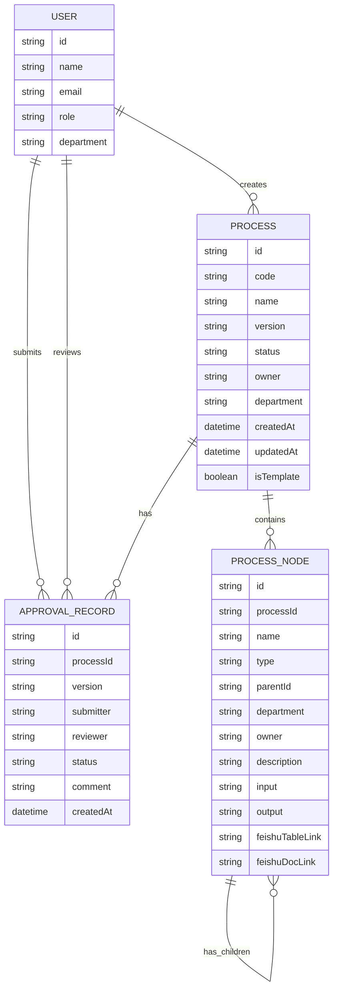

# 业务流程编辑网页端本地应用 - 技术架构文档

## 1. 架构设计

```mermaid
graph TD
    Frontend[前端 React + TypeScript]
    Backend[后端 Express + TypeScript]
    Database[(本地文件存储]
    External[飞书开放平台]

    Frontend --> Backend
    Backend --> Database
    Backend --> External
```

### 架构说明：
- **前端**: React 18 + TypeScript + Tailwind CSS，负责用户界面和交互逻辑
- **后端**: Express.js + TypeScript，提供 RESTful API，处理业务逻辑和数据存储
- **数据存储**: 本地文件系统（JSON格式），支持私有化部署，数据自主掌控
- **外部服务**: 飞书开放平台，用于飞书多维表格和云文档联动

## 2. 技术描述

- **前端**: React@18 + TypeScript + tailwindcss@3 + vite + zustand + react-router-dom
- **初始化工具**: vite-init
- **后端**: Express@4 + TypeScript
- **数据存储**: 本地JSON文件（无需额外数据库）
- **构建工具**: Vite

## 3. 路由定义

| 路由 | 用途 |
|-------|---------|
| / | 仪表盘/首页 |
| /login | 登录页面 |
| /templates | 流程模板库 |
| /processes | 流程列表 |
| /processes/:id | 流程编辑页面 |
| /processes/:id/versions | 版本历史 |
| /processes/:id/export | 流程导出 |
| /approval | 审核页面 |

## 4. API 定义

### 4.1 类型定义
```typescript
// 用户类型
interface User {
  id: string;
  name: string;
  email: string;
  role: 'it_admin' | 'process_owner' | 'business_user';
  department: string;
}

// 流程节点类型
interface ProcessNode {
  id: string;
  name: string;
  type: 'trunk' | 'sub';
  parentId?: string;
  department: string;
  owner: string;
  description: string;
  input: string;
  output: string;
  feishuTableLink?: string;
  feishuDocLink?: string;
  children: ProcessNode[];
}

// 流程类型
interface Process {
  id: string;
  code: string;
  name: string;
  version: string;
  status: 'draft' | 'pending_review' | 'approved';
  owner: string;
  department: string;
  createdAt: string;
  updatedAt: string;
  trunkNodes: ProcessNode[];
  isTemplate: boolean;
}

// 审核记录类型
interface ApprovalRecord {
  id: string;
  processId: string;
  version: string;
  submitter: string;
  reviewer: string;
  status: 'pending' | 'approved' | 'rejected';
  comment: string;
  createdAt: string;
}
```

### 4.2 API 端点

| 方法 | 路径 | 描述 |
|------|------|------|
| GET | /api/users | 获取用户列表 |
| GET | /api/processes | 获取流程列表 |
| POST | /api/processes | 创建流程 |
| PUT | /api/processes/:id | 更新流程 |
| GET | /api/processes/:id | 获取流程详情 |
| DELETE | /api/processes/:id/versions | 获取版本历史 |
| POST | /api/processes/:id/submit | 提交审核 |
| POST | /api/processes/:id/approve | 审核流程 |
| GET | /api/templates | 获取模板列表 |
| POST | /api/templates | 创建模板 |

## 5. 服务器架构图

```mermaid
graph LR
    Controller[控制器层]
    Service[服务层]
    Repository[数据访问层]
    Storage[(本地JSON存储]

    Controller --> Service
    Service --> Repository
    Repository --> Storage
```

## 6. 数据模型

### 6.1 数据模型定义



### 6.2 数据存储结构

```
/workspace/data/
├── users.json
├── processes.json
├── templates.json
├── approval_records.json
└── versions/
    └── {processId}_v{version}.json
```

### 6.3 初始化数据

```json
{
  "users": [
    {
      "id": "1",
      "name": "张IT管理员",
      "email": "it@company.com",
      "role": "it_admin",
      "department": "IT部"
    },
    {
      "id": "2",
      "name": "李流程Owner",
      "email": "owner@company.com",
      "role": "process_owner",
      "department": "生产部"
    },
    {
      "id": "3",
      "name": "王业务人员",
      "email": "business@company.com",
      "role": "business_user",
      "department": "生产部"
    }
  ],
  "templates": [
    {
      "id": "t1",
      "code": "TEMP-001",
      "name": "生产流程模板",
      "version": "V1.0",
      "status": "approved",
      "owner": "张IT管理员",
      "department": "IT部",
      "isTemplate": true,
      "trunkNodes": [
        {
          "id": "tn1",
          "name": "销售订单",
          "type": "trunk",
          "department": "销售部",
          "owner": "销售经理",
          "description": "接收客户订单",
          "input": "客户需求",
          "output": "确认订单",
          "children": []
        },
        {
          "id": "tn2",
          "name": "生产计划",
          "type": "trunk",
          "department": "计划部",
          "owner": "计划员",
          "description": "制定生产计划",
          "input": "订单信息",
          "output": "生产计划",
          "children": []
        },
        {
          "id": "tn3",
          "name": "物料齐套",
          "type": "trunk",
          "department": "采购部",
          "owner": "采购员",
          "description": "确认物料到位",
          "input": "生产计划",
          "output": "齐套确认",
          "children": []
        },
        {
          "id": "tn4",
          "name": "生产执行",
          "type": "trunk",
          "department": "生产部",
          "owner": "生产主管",
          "description": "执行生产任务",
          "input": "齐套物料",
          "output": "半成品/成品",
          "children": []
        },
        {
          "id": "tn5",
          "name": "质量检验",
          "type": "trunk",
          "department": "质量部",
          "owner": "质检员",
          "description": "产品检验",
          "input": "成品",
          "output": "检验报告",
          "children": []
        },
        {
          "id": "tn6",
          "name": "成品入库",
          "type": "trunk",
          "department": "仓储部",
          "owner": "仓管员",
          "description": "成品入库",
          "input": "合格成品",
          "output": "入库单",
          "children": []
        }
      ]
    }
  ]
}
```
