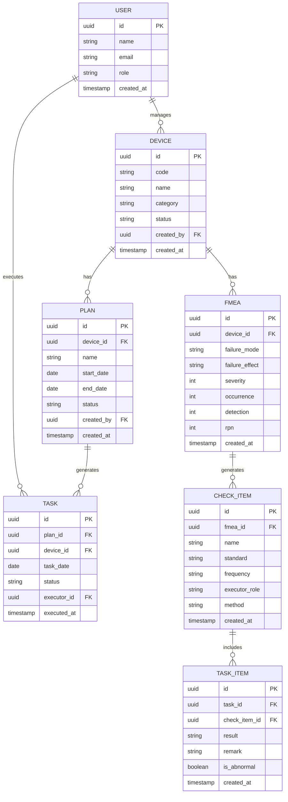

# 生产设备点巡检系统 - 技术架构文档

## 1. Architecture Design

```mermaid
graph TB
    subgraph "Frontend"
        A[React SPA]
        B[Tailwind CSS]
        C[Recharts]
        D[React Router]
    end

    subgraph "Backend"
        E[Supabase Auth]
        F[Supabase Database]
        G[Supabase Storage]
    end

    A --&gt; E
    A --&gt; F
    A --&gt; G
```

## 2. Technology Description
- Frontend: React@18 + tailwindcss@3 + vite
- Initialization Tool: vite-init
- Backend: Supabase
- Database: Supabase (PostgreSQL)
- 图表库: Recharts

## 3. Route Definitions
| Route | Purpose |
|-------|---------|
| / | 首页 - 仪表盘概览 |
| /devices | 设备管理 - 设备台账列表 |
| /devices/:id | 设备详情 - 设备信息与历史 |
| /fmea | FMEA分析 - 失效模式库 |
| /plans | 计划管理 - 点检计划列表 |
| /plans/create | 计划创建 - 向导式表单 |
| /tasks | 执行任务 - 待办任务看板 |
| /tasks/:id | 任务执行 - 点检记录提交 |
| /reports | 报表统计 - 数据可视化 |

## 4. Data Model

### 4.1 Data Model Definition



### 4.2 Data Definition Language

```sql
-- 用户表
CREATE TABLE users (
    id UUID PRIMARY KEY DEFAULT gen_random_uuid(),
    name TEXT NOT NULL,
    email TEXT UNIQUE NOT NULL,
    role TEXT NOT NULL CHECK (role IN ('admin', 'engineer', 'inspector', 'manager')),
    created_at TIMESTAMPTZ DEFAULT NOW()
);

-- 设备表
CREATE TABLE devices (
    id UUID PRIMARY KEY DEFAULT gen_random_uuid(),
    code TEXT UNIQUE NOT NULL,
    name TEXT NOT NULL,
    category TEXT NOT NULL,
    status TEXT NOT NULL DEFAULT 'normal',
    created_by UUID REFERENCES users(id),
    created_at TIMESTAMPTZ DEFAULT NOW()
);

-- FMEA表
CREATE TABLE fmea (
    id UUID PRIMARY KEY DEFAULT gen_random_uuid(),
    device_id UUID REFERENCES devices(id) ON DELETE CASCADE,
    failure_mode TEXT NOT NULL,
    failure_effect TEXT,
    severity INT CHECK (severity BETWEEN 1 AND 10),
    occurrence INT CHECK (occurrence BETWEEN 1 AND 10),
    detection INT CHECK (detection BETWEEN 1 AND 10),
    rpn INT GENERATED ALWAYS AS (severity * occurrence * detection) STORED,
    created_at TIMESTAMPTZ DEFAULT NOW()
);

-- 点检项目表
CREATE TABLE check_items (
    id UUID PRIMARY KEY DEFAULT gen_random_uuid(),
    fmea_id UUID REFERENCES fmea(id) ON DELETE CASCADE,
    name TEXT NOT NULL,
    standard TEXT NOT NULL,
    frequency TEXT NOT NULL,
    executor_role TEXT NOT NULL,
    method TEXT,
    created_at TIMESTAMPTZ DEFAULT NOW()
);

-- 点检计划表
CREATE TABLE plans (
    id UUID PRIMARY KEY DEFAULT gen_random_uuid(),
    device_id UUID REFERENCES devices(id) ON DELETE CASCADE,
    name TEXT NOT NULL,
    start_date DATE NOT NULL,
    end_date DATE,
    status TEXT NOT NULL DEFAULT 'active',
    created_by UUID REFERENCES users(id),
    created_at TIMESTAMPTZ DEFAULT NOW()
);

-- 任务表
CREATE TABLE tasks (
    id UUID PRIMARY KEY DEFAULT gen_random_uuid(),
    plan_id UUID REFERENCES plans(id) ON DELETE CASCADE,
    device_id UUID REFERENCES devices(id) ON DELETE CASCADE,
    task_date DATE NOT NULL,
    status TEXT NOT NULL DEFAULT 'pending',
    executor_id UUID REFERENCES users(id),
    executed_at TIMESTAMPTZ,
    created_at TIMESTAMPTZ DEFAULT NOW()
);

-- 任务明细表
CREATE TABLE task_items (
    id UUID PRIMARY KEY DEFAULT gen_random_uuid(),
    task_id UUID REFERENCES tasks(id) ON DELETE CASCADE,
    check_item_id UUID REFERENCES check_items(id) ON DELETE CASCADE,
    result TEXT,
    remark TEXT,
    is_abnormal BOOLEAN DEFAULT FALSE,
    created_at TIMESTAMPTZ DEFAULT NOW()
);

-- RLS 策略
ALTER TABLE users ENABLE ROW LEVEL SECURITY;
ALTER TABLE devices ENABLE ROW LEVEL SECURITY;
ALTER TABLE fmea ENABLE ROW LEVEL SECURITY;
ALTER TABLE check_items ENABLE ROW LEVEL SECURITY;
ALTER TABLE plans ENABLE ROW LEVEL SECURITY;
ALTER TABLE tasks ENABLE ROW LEVEL SECURITY;
ALTER TABLE task_items ENABLE ROW LEVEL SECURITY;

-- 公共读策略
CREATE POLICY "Allow authenticated read" ON users FOR SELECT TO authenticated USING (true);
CREATE POLICY "Allow authenticated read" ON devices FOR SELECT TO authenticated USING (true);
CREATE POLICY "Allow authenticated read" ON fmea FOR SELECT TO authenticated USING (true);
CREATE POLICY "Allow authenticated read" ON check_items FOR SELECT TO authenticated USING (true);
CREATE POLICY "Allow authenticated read" ON plans FOR SELECT TO authenticated USING (true);
CREATE POLICY "Allow authenticated read" ON tasks FOR SELECT TO authenticated USING (true);
CREATE POLICY "Allow authenticated read" ON task_items FOR SELECT TO authenticated USING (true);

-- 全权限策略（认证用户）
CREATE POLICY "Allow authenticated all" ON users FOR ALL TO authenticated USING (true) WITH CHECK (true);
CREATE POLICY "Allow authenticated all" ON devices FOR ALL TO authenticated USING (true) WITH CHECK (true);
CREATE POLICY "Allow authenticated all" ON fmea FOR ALL TO authenticated USING (true) WITH CHECK (true);
CREATE POLICY "Allow authenticated all" ON check_items FOR ALL TO authenticated USING (true) WITH CHECK (true);
CREATE POLICY "Allow authenticated all" ON plans FOR ALL TO authenticated USING (true) WITH CHECK (true);
CREATE POLICY "Allow authenticated all" ON tasks FOR ALL TO authenticated USING (true) WITH CHECK (true);
CREATE POLICY "Allow authenticated all" ON task_items FOR ALL TO authenticated USING (true) WITH CHECK (true);
```

