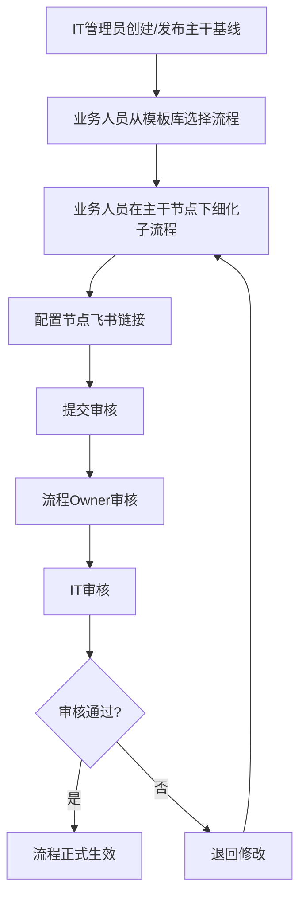
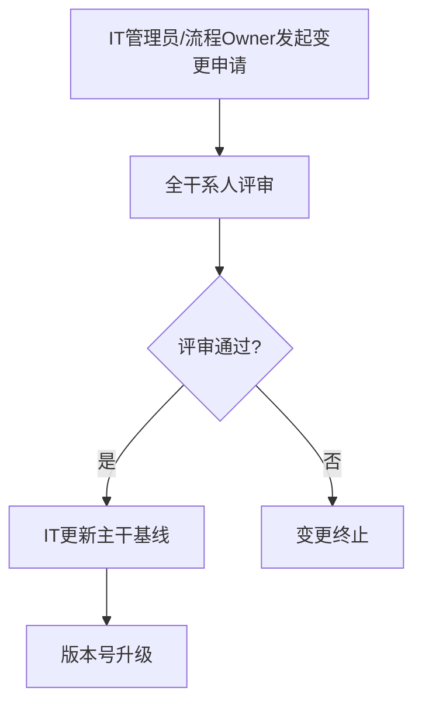

# 业务流程编辑网页端本地应用 - 产品需求文档

## 1. 产品概述
制造企业IT部门与业务部门沟通的统一业务流程梳理工具，解决制造企业业务流程梳理中"各部门各画各的、理解不一致"问题。
- 核心目标：为IT部门提供可强行管控的统一工具，确保所有业务梳理、需求输出、IT开发均基于唯一流程基线
- 价值：从根源减少IT系统反复小修小补的情况，实现"主干统一、细节可控、联动飞书、强制规范"

## 2. 核心功能

### 2.1 用户角色
| 角色 | 权限等级 | 核心权限 |
|------|----------|----------|
| IT管理员 | 最高 | 可创建/编辑/发布主干基线、管理模板库、配置权限、审核所有修改内容、管理版本、发起主干基线变更 |
| 流程Owner | 中等 | 可查看所有流程，审核业务人员提交的细节修改，发起主干基线变更申请 |
| 业务人员 | 最低 | 仅可查看主干基线，在主干节点下细化子流程/细节，提交修改审核，配置节点对应的飞书链接 |

### 2.2 功能模块
1. **登录页/首页**: 用户登录，仪表盘展示
2. **流程模板库**: IT管理员管理制造企业常用端到端主干基线模板
3. **流程列表与筛选**: 按流程名称、版本号、Owner、部门筛选流程
4. **流程编辑画布**: 主干基线固定显示，受控的子流程编辑
5. **节点详情与飞书链接配置**: 节点信息编辑，飞书多维表格/云文档链接配置
6. **审核流程**: 业务提交→流程Owner审核→IT审核，主干基线变更评审
7. **版本管理**: 版本号管理、修改记录留痕、版本回溯
8. **流程导出**: 导出为PDF、图片格式，标注版本号、审核状态、Owner

### 2.3 页面详情
| 页面名称 | 模块名称 | 功能描述 |
|-----------|-------------|---------------------|
| 登录页 | 登录模块 | 用户登录、角色选择 |
| 仪表盘 | 流程概览 | 展示当前用户相关流程、待审核事项、快速操作 |
| 流程模板库 | 模板管理 | IT管理员创建、编辑、删除流程模板 |
| 流程列表 | 流程筛选与搜索 | 按名称、版本、Owner、部门筛选，关键词搜索 |
| 流程编辑 | 主干节点展示 | 展示只读的主干节点，标注锁定图标 |
| 流程编辑 | 子流程编辑 | 业务人员在主干节点下添加、编辑子流程节点 |
| 节点详情 | 基础信息 | 编辑节点名称、责任人、时间节点、SOP |
| 节点详情 | 飞书链接配置 | 配置飞书多维表格记录链接、飞书云文档链接 |
| 审核页面 | 审核操作 | 查看待审核内容、提交审核意见 |
| 版本历史 | 版本管理 | 查看版本历史、选择版本回溯 |
| 导出页面 | 导出设置 | 选择导出格式、设置导出选项 |

## 3. 核心流程

### 3.1 流程创建与梳理流程

### 3.2 主干基线变更流程

## 4. 用户界面设计

### 4.1 设计风格
- **主色调**: 深蓝色 (#1e3a8a) + 工业蓝 (#3b82f6) - 适合制造企业专业、稳重的风格
- **强调色**: 橙色 (#f97316) - 用于操作按钮、警告提示
- **中性色**: 灰色系 (#f9fafb, #f3f4f6, #e5e7eb, #9ca3af, #6b7280, #374151)
- **按钮风格**: 圆角矩形，轻微阴影，悬停时上移效果
- **字体**: 主字体使用思源黑体(Sans-serif)，标题加粗，内容清晰易读
- **布局风格**: 三栏式布局，左侧导航/模板库，中间画布，右侧详情
- **图标**: 使用线性图标，风格统一，简洁明了

### 4.2 页面设计概述
| 页面名称 | 模块名称 | UI元素 |
|-----------|-------------|-------------|
| 登录页 | 登录模块 | 居中卡片式布局，背景使用渐变蓝，表单设计简洁 |
| 仪表盘 | 流程概览 | 卡片网格布局，展示关键指标和快速操作 |
| 流程列表 | 流程筛选与搜索 | 表格式展示，顶部搜索和筛选栏，支持分页 |
| 流程编辑 | 主干节点展示 | 横向流程线布局，节点卡片标注锁定图标，不可拖拽 |
| 流程编辑 | 子流程编辑 | 垂直布局，节点可拖拽添加，连接线条 |
| 节点详情 | 基础信息 | 表单式设计，标签+输入框组合 |
| 节点详情 | 飞书链接配置 | 分组式布局，飞书Logo标识，链接输入框 |
| 审核页面 | 审核操作 | 对比视图，展示修改前后内容，审核意见输入框 |
| 版本历史 | 版本管理 | 时间线布局，展示版本变更记录 |

### 4.3 响应式
- 桌面优先设计，自适应主流PC屏幕尺寸
- 支持Chrome、Edge、Firefox浏览器
- 三栏布局在小屏幕上可折叠侧边栏

### 4.4 交互设计
- 主干节点显示灰色锁定图标，不可拖拽
- 操作超出权限时弹出提示框
- 待审核内容标注橙色标识
- 节点配置飞书链接后显示飞书图标
