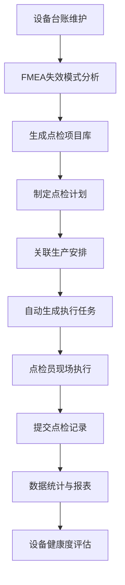

# 生产设备点巡检系统 PRD

## 1. Product Overview
生产设备点巡检系统，基于设备失效模式分析（FMEA）生成点检项目、标准、频次和执行角色，实现日常点检与长周期保养的计划制定、单据生成与现场执行闭环管理。

- 目标用户：设备工程师、点检员、生产管理人员
- 市场价值：提高设备可靠性，降低停机风险，优化维护资源配置

## 2. Core Features

### 2.1 User Roles
| Role | Registration Method | Core Permissions |
|------|---------------------|------------------|
| 系统管理员 | 后台创建 | 用户管理、系统配置、数据维护 |
| 设备工程师 | 后台创建 | 设备管理、FMEA分析、点检项目配置 |
| 点检员 | 后台创建 | 执行点检、保养任务、提交记录 |
| 生产管理者 | 后台创建 | 查看报表、监控执行情况 |

### 2.2 Feature Module
1. **设备管理页**: 设备台账、设备分类、设备信息维护
2. **FMEA分析页**: 失效模式录入、点检项目配置、标准/频次/角色设定
3. **计划管理页**: 点检计划制定、计划关联生产安排、计划审批
4. **执行任务页**: 待办任务列表、任务详情、记录提交
5. **报表统计页**: 执行率统计、异常趋势分析、设备健康度

### 2.3 Page Details
| Page Name | Module Name | Feature description |
|-----------|-------------|---------------------|
| 设备管理页 | 设备台账 | 设备列表展示、搜索筛选、新增/编辑/删除设备 |
| 设备管理页 | 设备信息 | 设备基本信息、附属部件、历史记录查看 |
| FMEA分析页 | 失效模式库 | 失效模式录入、失效后果、风险评估 |
| FMEA分析页 | 点检项目配置 | 基于失效模式创建点检项目、设置标准值、频次、执行角色 |
| 计划管理页 | 计划创建 | 选择设备/项目、设定周期、关联生产计划、生成点检计划 |
| 计划管理页 | 计划列表 | 计划状态管理、计划详情查看、计划调整 |
| 执行任务页 | 任务看板 | 按时间/设备/状态展示待办任务 |
| 执行任务页 | 任务执行 | 填写点检结果、上传照片/视频、提交记录 |
| 报表统计页 | 执行统计 | 点检执行率、及时率、异常率图表展示 |
| 报表统计页 | 趋势分析 | 设备异常趋势、历史对比、健康度评分 |

## 3. Core Process
**点检流程：**
设备工程师配置设备与FMEA分析 → 生成点检项目库 → 基于生产安排制定点检计划 → 系统自动生成任务单据 → 点检员接收并执行任务 → 提交点检记录 → 管理者查看报表与监控

## 4. User Interface Design
### 4.1 Design Style
- 主色调：工业蓝 (#2563eb) + 安全红 (#dc2626) + 警示黄 (#eab308)
- 按钮风格：圆角矩形（8px），主按钮渐变
- 字体：Inter 体系，标题 18-24px，正文 14px
- 布局风格：卡片式布局，顶部导航 + 侧边菜单
- 图标风格：线性图标，清晰易识别

### 4.2 Page Design Overview
| Page Name | Module Name | UI Elements |
|-----------|-------------|-------------|
| 设备管理页 | 设备台账 | 卡片式设备列表，搜索栏，状态标签，操作按钮 |
| FMEA分析页 | 失效模式库 | 表格展示，风险矩阵热力图，新增弹窗 |
| 计划管理页 | 计划创建 | 向导式表单，时间轴展示，预览功能 |
| 执行任务页 | 任务看板 | 时间线视图，任务卡片，状态颜色区分 |
| 报表统计页 | 执行统计 | 柱状图/折线图，数据卡片，筛选器 |

### 4.3 Responsiveness
- Desktop-first 设计
- 平板/移动端自适应
- 表单字段触控优化

