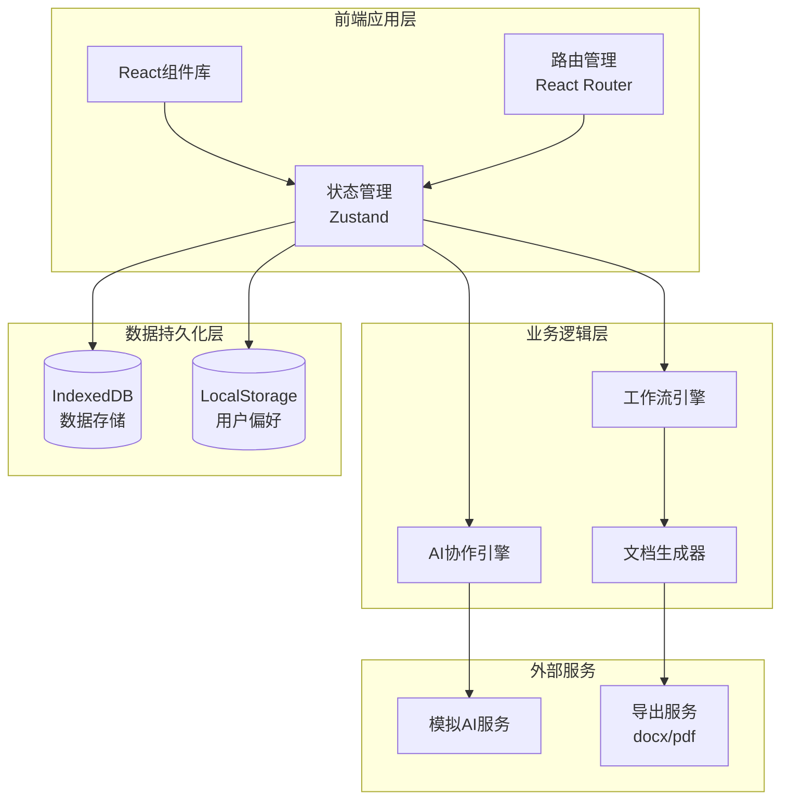
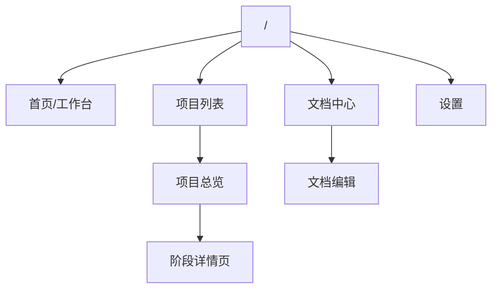
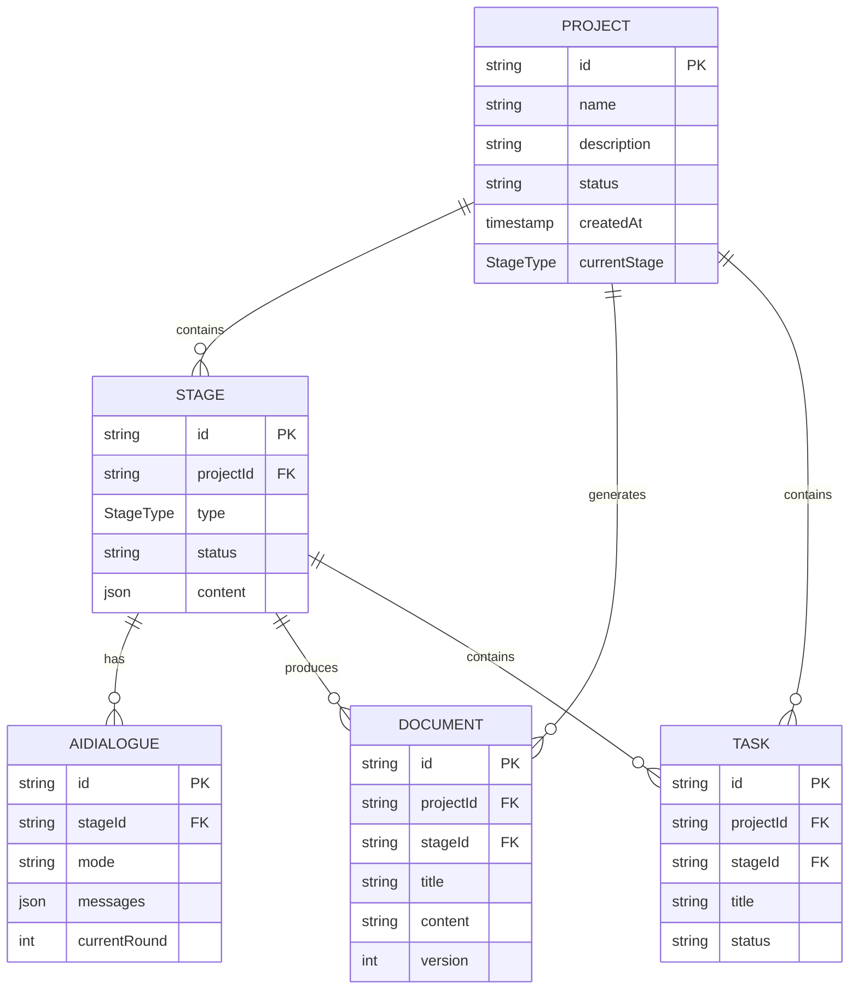
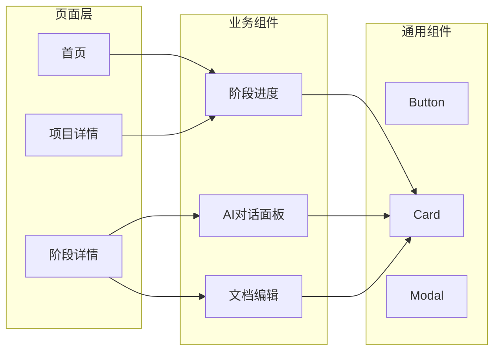
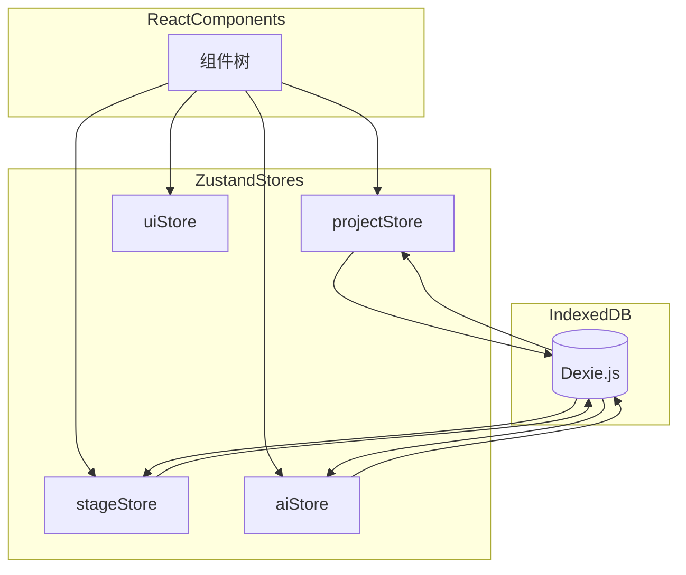
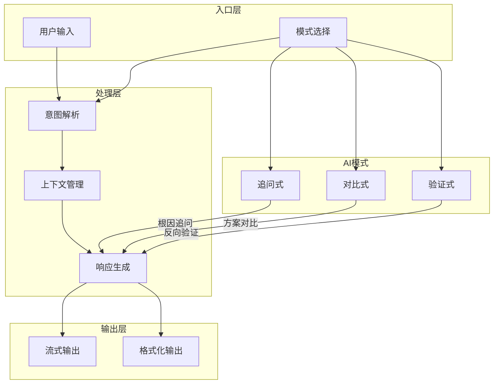

# 甲方产品经理工作流操作台 - 技术架构文档

## 1. 架构设计

### 1.1 系统架构概览



### 1.2 技术选型

| 技术类别 | 技术选型 | 版本 | 说明 |
|---------|---------|------|-----|
| 框架 | React | 18.x | 组件化、hooks、成熟生态 |
| 语言 | TypeScript | 5.x | 类型安全、智能提示 |
| 构建工具 | Vite | 5.x | 快速热更新、优秀的开发体验 |
| 样式方案 | Tailwind CSS | 3.x | 原子化CSS、快速开发 |
| 状态管理 | Zustand | 4.x | 轻量级、TypeScript友好 |
| 路由管理 | React Router | 6.x | SPA路由标准方案 |
| 数据存储 | Dexie.js | 3.x | IndexedDB封装、简洁API |
| 编辑器 | @tiptap/react | 2.x | 现代化富文本编辑器 |
| 图表 | Mermaid | - | 流程图、时序图渲染 |
| 导出 | docx/build | 8.x | Word文档生成 |
| 图标 | Lucide React | - | 线性图标库 |
| 日期 | dayjs | 1.x | 轻量级日期处理 |
| 唯一ID | nanoid | - | 短ID生成 |

---

## 2. 路由定义

| 路由路径 | 页面名称 | 功能描述 |
|---------|---------|---------|
| / | 首页/工作台 | 项目概览、待办事项、快捷入口 |
| /projects | 项目列表 | 所有项目卡片展示 |
| /project/:id | 项目总览 | 阶段进度、阶段卡片入口 |
| /project/:id/stage/:stageType | 阶段详情 | 各阶段的AI协作界面 |
| /documents | 文档中心 | 模板库、我的文档 |
| /documents/:docId | 文档编辑 | 文档编辑页面 |
| /settings | 设置 | 用户偏好、主题切换 |

### 2.1 路由结构树



---

## 3. 数据模型

### 3.1 核心数据实体

```typescript
// 项目实体
interface Project {
  id: string;
  name: string;
  description: string;
  status: 'planning' | 'active' | 'completed' | 'archived';
  createdAt: number;
  updatedAt: number;
  currentStage: StageType;
  members: ProjectMember[];
}

// 阶段实体
interface Stage {
  id: string;
  projectId: string;
  type: StageType;
  status: 'locked' | 'pending' | 'in_progress' | 'review' | 'completed';
  content: StageContent;
  aiContext: AIContext;
  documents: Document[];
  tasks: Task[];
  updatedAt: number;
}

// AI对话实体
interface AIDialogue {
  id: string;
  stageId: string;
  mode: 'questioning' | 'comparing' | 'validating';
  messages: AIMessage[];
  currentRound: number;
  createdAt: number;
}

interface AIMessage {
  id: string;
  role: 'user' | 'ai' | 'system';
  content: string;
  type?: 'question' | 'answer' | 'suggestion' | 'validation';
  intentTags?: string[];
  timestamp: number;
}

// 文档实体
interface Document {
  id: string;
  projectId: string;
  stageId: string;
  title: string;
  content: string;
  version: number;
  createdAt: number;
  updatedAt: number;
}

// 任务实体
interface Task {
  id: string;
  projectId: string;
  stageId: string;
  title: string;
  description?: string;
  status: 'pending' | 'in_progress' | 'completed';
  assigneeId?: string;
  dueDate?: number;
  createdAt: number;
}

// 枚举定义
type StageType = 
  | 'business-planning'      // 业务规划
  | 'process-mapping'        // 流程梳理
  | 'solution-design'       // 方案设计
  | 'system-architecture'   // 概要设计
  | 'prototype-design'      // 原型设计
  | 'detailed-design'       // 详细设计
  | 'test-cases'            // 用例编写
  | 'bp-testing'            // BP测试
  | 'acceptance'            // 验收
  | 'configuration'         // 配置
  | 'operations';           // 运维
```

### 3.2 数据关系图



---

## 4. 组件架构

### 4.1 组件目录结构

```
src/
├── components/
│   ├── common/              # 通用组件
│   │   ├── Button/
│   │   ├── Card/
│   │   ├── Modal/
│   │   ├── Input/
│   │   ├── Badge/
│   │   └── Icon/
│   ├── layout/               # 布局组件
│   │   ├── AppShell/
│   │   ├── Sidebar/
│   │   ├── Header/
│   │   └── Footer/
│   ├── workflow/             # 工作流组件
│   │   ├── StageProgress/
│   │   ├── StageCard/
│   │   └── StageContent/
│   ├── ai/                   # AI协作组件
│   │   ├── AIChatPanel/
│   │   ├── AIMessage/
│   │   ├── ModeSwitcher/
│   │   └── AIThinking/
│   ├── document/             # 文档组件
│   │   ├── DocumentEditor/
│   │   ├── DocumentList/
│   │   └── DocumentPreview/
│   └── project/              # 项目组件
│       ├── ProjectCard/
│       ├── ProjectHeader/
│       └── MemberList/
├── pages/                    # 页面组件
│   ├── Home/
│   ├── ProjectList/
│   ├── ProjectDetail/
│   ├── StageDetail/
│   ├── Documents/
│   └── Settings/
├── stores/                   # 状态管理
│   ├── projectStore.ts
│   ├── stageStore.ts
│   ├── aiStore.ts
│   └── uiStore.ts
├── hooks/                    # 自定义Hooks
│   ├── useProject.ts
│   ├── useAIChat.ts
│   ├── useLocalStorage.ts
│   └── useIndexedDB.ts
├── services/                 # 服务层
│   ├── db.ts                 # IndexedDB服务
│   ├── aiService.ts          # AI服务
│   └── exportService.ts      # 导出服务
├── utils/                    # 工具函数
│   ├── formatDate.ts
│   ├── generateId.ts
│   └── markdown.ts
├── constants/                # 常量定义
│   ├── stages.ts
│   └── theme.ts
└── types/                    # 类型定义
    └── index.ts
```

### 4.2 核心组件关系



---

## 5. 状态管理设计

### 5.1 Store划分

| Store | 职责 | 主要状态 |
|-------|-----|---------|
| projectStore | 项目管理 | projects[], currentProject |
| stageStore | 阶段管理 | stages[], currentStage, stageContent |
| aiStore | AI对话 | dialogues[], currentDialogue, messages[] |
| uiStore | UI状态 | sidebarOpen, theme, activeModal |

### 5.2 状态管理架构



---

## 6. AI协作引擎设计

### 6.1 AI服务架构



### 6.2 模拟AI服务

由于本项目为前端应用，将实现模拟AI服务，提供真实的交互体验：

```typescript
// AI响应模板示例
const AI_TEMPLATES = {
  questioning: {
    businessPlanning: [
      "请问这个需求的业务背景是什么？为什么要做这个系统？",
      "能否详细描述一下当前的痛点？这对业务有多大影响？",
      "您提到的"效率低下"，具体是指哪些环节？每个环节大概浪费多少时间？",
      "如果不做这个系统，会有什么后果？业务会受到多大影响？"
    ]
  },
  comparing: {
    architectureOptions: [
      { name: "单体架构", pros: ["开发简单", "部署便捷", "调试容易"], cons: ["扩展性差", "维护困难"] },
      { name: "微服务架构", pros: ["高扩展", "独立部署", "技术灵活"], cons: ["复杂度高", "运维成本大"] }
    ]
  }
};
```

---

## 7. 索引数据库设计

### 7.1 数据库Schema

```typescript
// db.ts - Dexie.js数据库定义
import Dexie, { Table } from 'dexie';

class PMWorkflowDB extends Dexie {
  projects!: Table<Project>;
  stages!: Table<Stage>;
  dialogues!: Table<AIDialogue>;
  documents!: Table<Document>;
  tasks!: Table<Task>;

  constructor() {
    super('pm-workflow-db');
    this.version(1).stores({
      projects: 'id, name, status, createdAt',
      stages: 'id, projectId, type, status',
      dialogues: 'id, stageId, mode, createdAt',
      documents: 'id, projectId, stageId, title, createdAt',
      tasks: 'id, projectId, stageId, status'
    });
  }
}

export const db = new PMWorkflowDB();
```

### 7.2 数据持久化策略

| 操作 | 触发时机 | 存储目标 |
|------|---------|---------|
| 自动保存 | 内容变化后2秒 | IndexedDB |
| 手动保存 | 用户点击保存 | IndexedDB + LocalStorage标记 |
| 页面离开 | beforeunload事件 | IndexedDB |
| 数据导出 | 用户触发导出 | 生成JSON文件下载 |

---

## 8. 关键算法

### 8.1 阶段解锁逻辑

```typescript
// 阶段解锁规则
const STAGE_UNLOCK_RULES: Record<StageType, StageType[]> = {
  'business-planning': [],                    // 第一阶段无需前置
  'process-mapping': ['business-planning'],   // 需要完成业务规划
  'solution-design': ['process-mapping'],     // 需要完成流程梳理
  'system-architecture': ['solution-design'],// 需要完成方案设计
  'prototype-design': ['system-architecture'],
  'detailed-design': ['prototype-design'],
  'test-cases': ['detailed-design'],
  'bp-testing': ['test-cases'],
  'acceptance': ['bp-testing'],
  'configuration': ['acceptance'],
  'operations': ['configuration', 'acceptance']
};

function canUnlockStage(currentStage: StageType, targetStage: StageType): boolean {
  const prerequisites = STAGE_UNLOCK_RULES[targetStage];
  return prerequisites.every(stage => 
    getStageStatus(currentStage) >= getStageStatus(stage)
  );
}
```

### 8.2 AI意图识别

```typescript
// 意图识别关键词映射
const INTENT_KEYWORDS = {
  goal: ['目标', '目的', 'KPI', '指标', '达成', '提升', '增加'],
  painPoint: ['痛点', '问题', '困难', '障碍', '卡点', '瓶颈'],
  boundary: ['范围', '边界', '不包括', '不做', '限制', '约束'],
  stakeholder: ['干系人', '负责人', '使用者', '相关方', '部门'],
  exception: ['如果', '异常', '错误', '失败', '边界', '极端情况']
};

function recognizeIntent(text: string): string[] {
  return Object.entries(INTENT_KEYWORDS)
    .filter(([_, keywords]) => 
      keywords.some(keyword => text.includes(keyword))
    )
    .map(([intent]) => intent);
}
```

---

## 9. 性能优化策略

### 9.1 加载优化

| 策略 | 实现方式 | 预期效果 |
|------|---------|---------|
| 代码分割 | React.lazy + Suspense | 首屏加载 < 200KB |
| 图片优化 | WebP格式 + 懒加载 | 图片资源按需加载 |
| 预加载 | 预判用户行为提前加载 | 阶段切换无感知 |

### 9.2 运行时优化

| 策略 | 实现方式 | 预期效果 |
|------|---------|---------|
| 虚拟列表 | react-window | 长列表渲染流畅 |
| 防抖保存 | 2秒防抖 + 乐观更新 | 减少存储压力 |
| 记忆化 | React.memo + useMemo | 减少不必要的重渲染 |

---

## 10. 技术架构总结

本应用采用**纯前端架构**，通过IndexedDB实现本地数据持久化，通过模拟AI服务实现智能协作体验。整体架构遵循以下原则：

1. **模块化**：清晰的分层和组件划分，便于维护和扩展
2. **类型安全**：TypeScript全覆盖，运行时错误最小化
3. **性能优先**：代码分割、虚拟滚动、防抖优化
4. **离线优先**：IndexedDB本地存储，支持离线使用
5. **可扩展**：模块化设计便于后续接入真实AI服务
