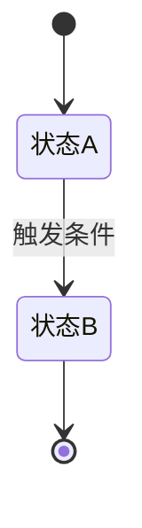
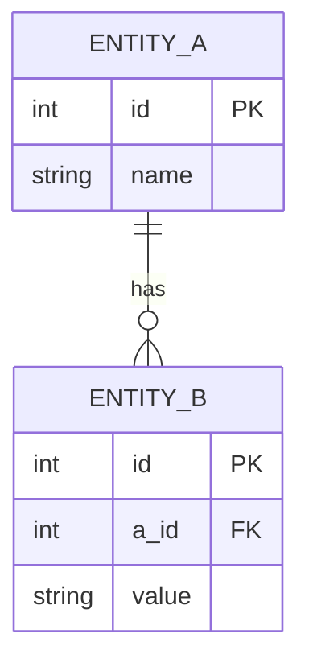

# 系统设计文档输出模板（AI版）

> **来源：** [系统方案设计文档模板](https://alink-app.feishu.cn/wiki/ZfSwwNdHDikWnakJayncAlq3nyb)
> **用途：** AI 在生成系统设计文档时，必须严格遵循以下章节结构、内容颗粒度和格式约束。
> **版本：** V1.0
> **自动更新：**基于模板来源，每次确认是否获取原始文档后自动更新模板内容

---

## 一、文档更新记录

**约束：**

- 每次修改必须更新记录，禁止无记录直接修改
- 表格字段：日期、作者、版本、更改备注、禅道任务号、相关文档
- 更改备注必须写清"增加/修改了XXX内容"，并锚定到文档具体位置（链接）
- 相关文档列需列出：需求文档、设计方案、功能SOP

**格式：**

| 日期 | 作者 | 版本 | 更改备注 | 禅道任务号 | 相关文档 |
|------|------|------|---------|-----------|---------|
| YYYY-MM-DD | 姓名 | v1.0 | 初稿 | #任务号 | 链接 |

---

## 二、需求背景及业务说明

### 2.1 业务背景及业务目标

**约束：**

- 表格形式，每行一个核心痛点
- 字段：序号、核心痛点、预期业务效果（**必须量化**，如"从30%降至5%"）、业务重要紧急度
- 禁止模糊表述，痛点必须有数据支撑

**格式：**

| 序号 | 核心痛点 | 预期业务效果（量化） | 业务重要紧急度 |
|------|---------|-------------------|--------------|
| 1 | 痛点描述 | 从X%降至Y%，提升Z% | 高/中/低 |

### 2.2 业务核心规则

**约束：** 必须按以下四类规则分别输出，缺一不可。

**格式：** 每条规则必须写清 **条件 → 动作 → 结果**，禁止只写结论不写触发条件。

#### 2.2.1 基础规则

字段填写规范、必填项、下拉选项、归属权逻辑、审批流程、频次限制等。

| 规则编号 | 规则类型 | 触发条件 | 执行动作 | 输出结果 |
|---------|---------|---------|---------|---------|
| R-001 | 必填校验 | 当用户提交表单时 | 校验必填字段是否为空 | 为空则提示错误，禁止提交 |

#### 2.2.2 时效规则

每个环节的超时阈值、超时后的自动处理动作（提醒/升级/释放）。

| 规则编号 | 环节 | 超时阈值 | 超时动作 | 升级路径 |
|---------|------|---------|---------|---------|
| T-001 | 审批环节 | 24h | 自动提醒审批人 | 超时48h升级至上级 |

#### 2.2.3 合规规则

重复校验逻辑、虚假/违规处罚机制、字段格式校验规则。

| 规则编号 | 校验场景 | 校验逻辑 | 违规处理 |
|---------|---------|---------|---------|
| C-001 | 重复提交 | 按设备+时间+类型去重 | 提示"已存在相同记录" |

#### 2.2.4 异常场景处理规则

匹配不到人、推送失败、超时未处理等场景的兜底方案。

| 规则编号 | 异常场景 | 触发条件 | 兜底方案 |
|---------|---------|---------|---------|
| E-001 | 匹配不到责任人 | 按规则匹配后结果为空 | 自动指派给值班组长 |

### 2.3 人员角色及权限说明

**约束：**

- 列出每个角色的职责 + 权力（含数据权限范围）
- 必须明确：谁可以看什么、谁可以操作什么、谁可以配置什么

**格式：**

| 角色 | 职责 | 数据权限范围 | 操作权限 | 配置权限 |
|------|------|------------|---------|---------|
| 角色名 | 一句话描述 | 可见哪些数据 | 可执行哪些操作 | 可配置哪些参数 |

### 2.4 业务流程及活动说明

**约束：**

- **必须包含业务流程图**（标注在整体业务架构中的位置及上下游）
- **必须包含流程活动说明表**，每个活动需写明：参与角色、执行活动、执行标准/规则、输入、输出
- **必须包含业务表单**：表单字段定义、字段类型、校验规则

**格式：**

#### 业务流程图


#### 流程活动说明表

| 活动编号 | 活动名称 | 参与角色 | 执行活动 | 执行标准/规则 | 输入 | 输出 |
|---------|---------|---------|---------|-------------|------|------|
| A-01 | 活动名 | 角色 | 具体操作描述 | 规则说明 | 输入数据 | 输出数据 |

#### 业务表单定义

| 字段名 | 字段类型 | 长度 | 必填 | 默认值 | 校验规则 | 说明 |
|--------|---------|------|------|--------|---------|------|
| field_name | string | 50 | 是 | - | 正则校验 | 字段说明 |

### 2.5 业务需求确认 Checklist

**约束：** 输出时必须逐条自检以下10项，每项必须回答"是/否"。

| # | 检查项 | 通过 |
|---|--------|------|
| 1 | 核心痛点和量化目标是否无模糊表述？ | ☐ 是 ☐ 否 |
| 2 | 每个功能的"触发条件→执行动作→输出结果"是否清晰？ | ☐ 是 ☐ 否 |
| 3 | "做什么、不做什么"是否明确无争议？ | ☐ 是 ☐ 否 |
| 4 | 所有相关角色的权限和操作是否无遗漏？ | ☐ 是 ☐ 否 |
| 5 | 异常场景是否有处理方案？ | ☐ 是 ☐ 否 |
| 6 | 所有时间、准确率等指标是否量化？ | ☐ 是 ☐ 否 |
| 7 | 开发看了知道"怎么实现"（不用额外追问）？ | ☐ 是 ☐ 否 |
| 8 | 测试看了知道"怎么测、测什么"（不用额外追问）？ | ☐ 是 ☐ 否 |
| 9 | 交付时能通过"操作+数据"证明需求达标？ | ☐ 是 ☐ 否 |
| 10 | 全团队对需求的理解是否一致？ | ☐ 是 ☐ 否 |

---

## 三、系统详细设计方案

### 3.1 功能简介及使用说明

**约束：**

- 先写功能使用说明（面向用户视角）
- 开发完成后需补充功能使用手册链接

**格式：**

```markdown
### 功能名称

**使用说明：** 用户如何操作该功能，分步骤描述。

**前置条件：** 使用前需要满足的条件。

**操作步骤：**
1. 步骤一
2. 步骤二
3. 步骤三

**使用手册：** [链接]（开发完成后补充）
```

### 3.2 页面结构

**约束：** 必须输出页面层级结构（树状或列表），标注每个页面的核心用途。

**格式：**

```
系统名称
├── 页面1（用途：XXX）
│   ├── 子页面1.1（用途：XXX）
│   └── 子页面1.2（用途：XXX）
└── 页面2（用途：XXX）
    └── 子页面2.1（用途：XXX）
```

### 3.3 功能模块

**约束：** 每个模块独立描述，必须包含：模块名称、功能描述、触发入口、前置条件、后置条件。

**格式：**

| 字段 | 内容 |
|------|------|
| 模块名称 | 模块名 |
| 功能描述 | 一句话说明 |
| 触发入口 | 用户如何进入该模块 |
| 前置条件 | 进入前必须满足的条件 |
| 后置条件 | 操作完成后产生的效果 |

### 3.4 交互行为

**约束：** 每个交互行为必须写清：用户操作 → 系统响应 → 界面变化。包含正常流程和异常流程。

**格式：**

| 场景 | 用户操作 | 系统响应 | 界面变化 |
|------|---------|---------|---------|
| 正常流程 | 点击按钮 | 调用接口，返回成功 | 弹出"操作成功"提示 |
| 异常流程 | 点击按钮 | 调用接口，返回失败 | 弹出错误提示+错误码 |

### 3.5 状态设计

**约束：**

- 必须输出状态机/状态流转图
- 每个状态需说明：状态名称、含义、可进入该状态的前置状态、可迁出的目标状态、触发条件

**格式：**



| 状态名称 | 含义 | 前置状态 | 可迁出目标状态 | 触发条件 |
|---------|------|---------|--------------|---------|
| 状态A | 说明 | - | 状态B | 条件描述 |

### 3.6 相关规范

**约束：** 涉及编码规范、命名规范、UI规范等必须在此处引用或说明。

**格式：**

| 规范类型 | 规范内容 | 说明 |
|---------|---------|------|
| 编码规范 | 规则描述 | 补充说明 |

### 3.7 数据结构及数据模型

**约束：**

- **必须包含ER关系图**（实体间关系）
- **必须包含表清单**，每张表需说明：表名、用途、核心字段（字段名/类型/长度/是否必填/默认值/说明）

**格式：**



#### 表清单

| 表名 | 用途 | 核心字段 |
|------|------|---------|
| table_name | 用途说明 | 见下表 |

#### 字段定义

| 字段名 | 类型 | 长度 | 必填 | 默认值 | 主键 | 外键 | 说明 |
|--------|------|------|------|--------|------|------|------|
| id | int | 11 | 是 | - | PK | - | 主键ID |
| name | varchar | 50 | 是 | - | - | - | 名称 |

### 3.8 相关接口

**约束：** 表格形式，每行一个接口。

| 接口名称 | 接口用途 | 请求方式 | 核心参数 | 响应结果 |
|---------|---------|---------|---------|---------|
| 中文名 | 一句话说明 | GET/POST/PUT/DELETE | 参数名+类型+说明+是否必填 | 示例JSON |

**响应格式示例：**

```json
{
    "code": 0,
    "msg": "success",
    "data": {}
}
```

### 3.9 性能需求

| 需求类型 | 指标 | 目标值 |
|---------|------|--------|
| 页面响应 | 列表页加载时间 | ≤ 2秒 |
| 页面响应 | 详情页加载时间 | ≤ 1秒 |
| 接口响应 | 查询接口响应时间 | ≤ 500ms |
| 批处理性能 | 数据计算任务 | 根据业务场景定义 |
| 系统可用性 | 服务可用率 | ≥ 99.5% |
| 并发处理 | 支持并发用户数 | ≥ 100人 |


### 3.10 业务数据字典

**约束：** 列出所有业务术语的定义，消除歧义。

| 术语 | 定义 | 备注 |
|------|------|------|
| 术语名称 | 一句话定义 | 补充说明 |

### 3.11 系统提示字典

**约束：** 表格列出所有系统提示文案，标注触发条件。

| 提示类型 | 触发条件 | 提示文案 | 提示级别 |
|---------|---------|---------|---------|
| 成功 | 操作成功 | "操作成功" | success |
| 失败 | 操作失败 | "操作失败，原因：{error}" | error |
| 确认 | 执行删除前 | "确认删除？此操作不可恢复" | warning |

### 3.12 系统配置清单

**约束：** 所有可配置项（阈值、开关、参数等）必须列出，含默认值和可选项。

| 配置项 | 说明 | 默认值 | 可选项 | 配置位置 |
|--------|------|--------|--------|---------|
| config_key | 配置说明 | default_value | option_a, option_b | 配置文件/页面 |

### 3.13 风险及异常处理

**约束：**

- 列出已识别的所有风险点
- 每个风险需说明：风险描述、影响范围、发生概率、应对措施、备选方案

| 风险编号 | 风险描述 | 影响范围 | 发生概率 | 应对措施 | 备选方案 |
|---------|---------|---------|---------|---------|---------|
| RISK-001 | 风险描述 | 影响范围 | 高/中/低 | 主要措施 | 备选方案 |

---

## 四、附录

### 4.1 引用文档

**约束：** 补充文档中引用的外部资料、参考文档、术语表等。

| 序号 | 文档名称 | 文档链接 | 说明 |
|------|---------|---------|------|
| 1 | 文档名 | 链接 | 说明 |

### 4.2 待确认项清单

| # | 内容 | 当前假设 | 确认状态 |
|---|------|---------|---------|
| 1 | 例：阈值配置 | 默认值 | 待确认 |

### 4.3 验收标准

#### 4.2.1 功能验收标准

| 功能模块 | 验收项 | 验收标准 | 验证方式 |
|---------|--------|---------|---------|
| 例：用户注册 | 注册成功 | 返回用户ID | 功能测试 |

#### 4.2.2 非功能验收标准

| 类型 | 验收项 | 验收标准 | 验证方式 |
|------|--------|---------|---------|
| 性能 | 页面响应 | ≤ 2秒 | 性能测试 |
| 数据 | 数据准确性 | ≥ 99.9% | 数据对比 |
| 集成 | 接口成功率 | ≥ 99% | 集成测试 |

#### 4.2.3 用户验收标准

| 验收项 | 验收标准 | 验证方式 |
|--------|---------|---------|
| 例：操作效率 | 操作时间缩短 60% | 操作时间对比 |


---

## 总则（AI必须遵守）

1. **禁止模糊表述**：所有指标必须量化，所有规则必须写清"条件→动作→结果"
2. **禁止遗漏异常场景**：每个功能点必须配套异常处理方案
3. **禁止角色遗漏**：所有涉及的角色必须定义权限边界
4. **禁止无校验逻辑**：字段格式、重复校验、权限校验必须在规则中明确
5. **禁止无状态设计**：涉及流程流转的功能必须有状态机定义
6. **禁止无接口定义**：系统间交互必须定义接口（名称/参数/响应）
7. **输出格式**：优先使用表格、列表、流程图（Mermaid）结构化呈现，禁止大段散文
