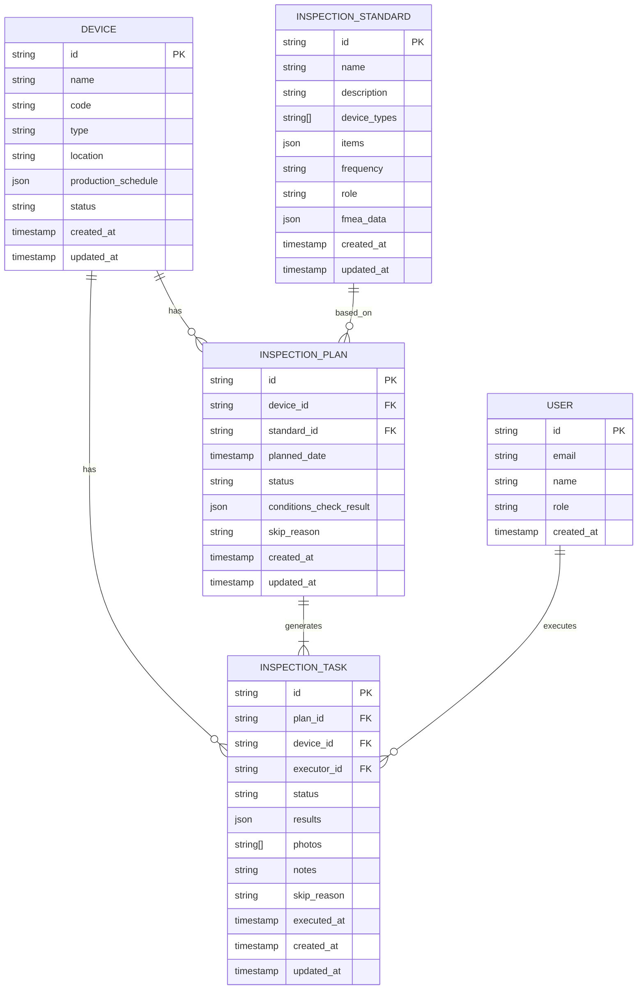

# 点检标准及执行管理系统 技术架构

## 1. Architecture Design
本系统采用典型的前后端分离架构，前端使用React构建交互式界面，后端业务逻辑通过Supabase服务端能力实现，数据库使用Supabase提供的PostgreSQL。

```mermaid
graph TD
    subgraph "Frontend"
        A[React Web App]
        B[Admin Dashboard]
        C[Mobile Execution Page]
    end
    
    subgraph "Backend Services"
        D[Supabase Auth]
        E[Supabase Database]
        F[Supabase Storage]
    end
    
    subgraph "External Services"
        G[生产系统API]
        H[文件存储]
    end
    
    A &lt;--&gt; D
    A &lt;--&gt; E
    A &lt;--&gt; F
    E &lt;--&gt; G
    F &lt;--&gt; H
```

## 2. Technology Description
- Frontend: React@18 + tailwindcss@3 + vite + antd
- Initialization Tool: vite-init
- Backend: Supabase (无额外后端服务)
- Database: Supabase (PostgreSQL)
- 图表库: ECharts for React
- 状态管理: Zustand

## 3. Route Definitions
| Route | Purpose |
|-------|---------|
| / | 首页/仪表盘 |
| /devices | 设备档案管理 |
| /standards | 点检标准管理 |
| /plans | 点检计划管理 |
| /tasks | 点检任务执行 |
| /analytics | 数据统计分析 |
| /settings | 系统设置 |

## 4. API Definitions (if backend exists)
本系统使用Supabase客户端SDK直接操作数据库，无额外后端API定义

```typescript
// 核心数据类型定义
interface Device {
  id: string;
  name: string;
  code: string;
  type: string;
  location: string;
  production_schedule: any;
  status: 'active' | 'maintenance' | 'inactive';
  created_at: string;
  updated_at: string;
}

interface InspectionStandard {
  id: string;
  name: string;
  description: string;
  device_types: string[];
  items: InspectionItem[];
  frequency: string;
  role: string;
  fmea_data: any;
  created_at: string;
  updated_at: string;
}

interface InspectionItem {
  id: string;
  name: string;
  standard: string;
  method: string;
  tool: string;
  is_critical: boolean;
}

interface InspectionPlan {
  id: string;
  device_id: string;
  standard_id: string;
  planned_date: string;
  status: 'draft' | 'confirmed' | 'executing' | 'completed' | 'skipped';
  conditions_check_result: any;
  skip_reason: string;
  created_at: string;
  updated_at: string;
}

interface InspectionTask {
  id: string;
  plan_id: string;
  device_id: string;
  executor_id: string;
  status: 'pending' | 'in_progress' | 'completed' | 'skipped';
  results: InspectionResult[];
  photos: string[];
  notes: string;
  skip_reason: string;
  executed_at: string;
  created_at: string;
  updated_at: string;
}

interface InspectionResult {
  item_id: string;
  result: 'pass' | 'fail' | 'na';
  value: string;
  notes: string;
}
```

## 5. Server Architecture Diagram (if backend exists)
本系统无额外后端服务，直接使用Supabase提供的服务端能力

## 6. Data Model

### 6.1 Data Model Definition


### 6.2 Data Definition Language
```sql
-- 创建设备表
CREATE TABLE devices (
    id UUID DEFAULT gen_random_uuid() PRIMARY KEY,
    name VARCHAR(255) NOT NULL,
    code VARCHAR(100) NOT NULL UNIQUE,
    type VARCHAR(100) NOT NULL,
    location VARCHAR(255),
    production_schedule JSONB,
    status VARCHAR(50) DEFAULT 'active',
    created_at TIMESTAMPTZ DEFAULT NOW(),
    updated_at TIMESTAMPTZ DEFAULT NOW()
);

-- 创建点检标准表
CREATE TABLE inspection_standards (
    id UUID DEFAULT gen_random_uuid() PRIMARY KEY,
    name VARCHAR(255) NOT NULL,
    description TEXT,
    device_types TEXT[] NOT NULL,
    items JSONB NOT NULL,
    frequency VARCHAR(100) NOT NULL,
    role VARCHAR(100) NOT NULL,
    fmea_data JSONB,
    created_at TIMESTAMPTZ DEFAULT NOW(),
    updated_at TIMESTAMPTZ DEFAULT NOW()
);

-- 创建点检计划表
CREATE TABLE inspection_plans (
    id UUID DEFAULT gen_random_uuid() PRIMARY KEY,
    device_id UUID NOT NULL REFERENCES devices(id),
    standard_id UUID NOT NULL REFERENCES inspection_standards(id),
    planned_date TIMESTAMPTZ NOT NULL,
    status VARCHAR(50) DEFAULT 'draft',
    conditions_check_result JSONB,
    skip_reason TEXT,
    created_at TIMESTAMPTZ DEFAULT NOW(),
    updated_at TIMESTAMPTZ DEFAULT NOW()
);

-- 创建点检任务表
CREATE TABLE inspection_tasks (
    id UUID DEFAULT gen_random_uuid() PRIMARY KEY,
    plan_id UUID NOT NULL REFERENCES inspection_plans(id),
    device_id UUID NOT NULL REFERENCES devices(id),
    executor_id UUID NOT NULL REFERENCES auth.users(id),
    status VARCHAR(50) DEFAULT 'pending',
    results JSONB,
    photos TEXT[],
    notes TEXT,
    skip_reason TEXT,
    executed_at TIMESTAMPTZ,
    created_at TIMESTAMPTZ DEFAULT NOW(),
    updated_at TIMESTAMPTZ DEFAULT NOW()
);

-- 创建索引
CREATE INDEX idx_devices_type ON devices(type);
CREATE INDEX idx_plans_device_id ON inspection_plans(device_id);
CREATE INDEX idx_plans_date ON inspection_plans(planned_date);
CREATE INDEX idx_tasks_executor ON inspection_tasks(executor_id);
CREATE INDEX idx_tasks_status ON inspection_tasks(status);

-- 配置行级安全策略
ALTER TABLE devices ENABLE ROW LEVEL SECURITY;
ALTER TABLE inspection_standards ENABLE ROW LEVEL SECURITY;
ALTER TABLE inspection_plans ENABLE ROW LEVEL SECURITY;
ALTER TABLE inspection_tasks ENABLE ROW LEVEL SECURITY;

-- 授权策略示例
CREATE POLICY "允许所有认证用户查看设备" 
ON devices FOR SELECT 
TO authenticated 
USING (true);

CREATE POLICY "允许设备管理员管理设备" 
ON devices FOR ALL 
TO authenticated 
USING (auth.jwt() -&gt;&gt; 'role' = 'device_admin');

-- 更多策略根据实际需求配置
```
