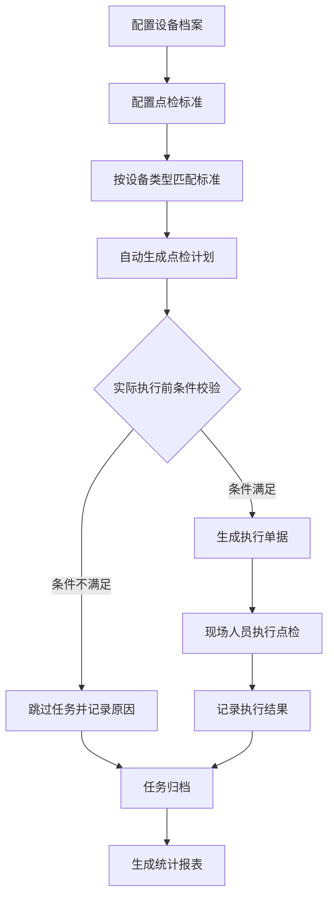

# 点检标准及执行管理系统 PRD

## 1. Product Overview
本系统旨在优化生产设备的点检和维护流程，通过标准化点检项目管理、动态计划生成和闭环执行记录，解决传统点检中计划与实际执行脱节、条件不匹配导致的无效任务、以及追溯能力不足等问题。
- 主要服务于生产制造企业的设备管理部门、维护班组和现场操作人员
- 目标是提高设备维护效率，降低点检遗漏风险，形成完备的设备维护管理闭环

## 2. Core Features

### 2.1 User Roles
| Role | Registration Method | Core Permissions |
|------|---------------------|------------------|
| 设备管理员 | 企业邮箱注册 | 点检标准管理、设备档案管理、数据统计分析 |
| 维护主管 | 企业邮箱注册 | 点检计划审核、任务分配、报表查看 |
| 现场维护员 | 企业邮箱注册 | 点检任务执行、结果记录、异常上报 |
| 系统管理员 | 内部分配 | 用户管理、系统配置、权限管理 |

### 2.2 Feature Module
1. **设备档案管理页**: 设备信息维护、设备分类标签管理、生产排程关联
2. **点检标准管理页**: 点检标准库维护、失效模式分析(FMEA)、标准与设备类型关联
3. **点检计划管理页**: 计划生成与查看、条件校验配置、计划调整
4. **点检任务执行页**: 任务看板、执行表单、结果记录、未执行原因填报
5. **数据统计分析页**: 点检覆盖率统计、计划执行分析、异常趋势看板

### 2.3 Page Details
| Page Name | Module Name | Feature description |
|-----------|-------------|---------------------|
| 设备档案管理页 | 设备信息维护 | 设备基础信息录入、设备类型标签配置、生产排班窗口设置 |
| 设备档案管理页 | 排程关联管理 | 与生产系统对接同步生产计划、空闲窗口期自动识别 |
| 点检标准管理页 | 标准库管理 | 点检项目创建、标准参数配置、频次与执行角色设置、失效模式关联 |
| 点检标准管理页 | 标准匹配配置 | 设备类型与点检标准自动关联规则配置、个性化覆盖规则 |
| 点检计划管理页 | 计划生成 | 基于设备标准自动生成点检计划、计划预览与确认 |
| 点检计划管理页 | 计划调整 | 计划手动调整、批量操作、历史版本追溯 |
| 点检任务执行页 | 任务看板 | 个人任务列表、按设备/时间筛选、任务状态展示 |
| 点检任务执行页 | 执行记录 | 标准执行表单、拍照上传、异常情况记录、未执行原因填报 |
| 数据统计分析页 | 覆盖分析 | 设备点检计划覆盖率统计、标准执行率分析 |
| 数据统计分析页 | 异常追踪 | 未执行原因分类统计、异常趋势分析图表 |

## 3. Core Process
系统核心流程分为三个阶段：标准配置阶段、计划生成阶段和执行闭环阶段。首先配置设备档案和点检标准，然后基于标准和设备信息自动生成点检计划，最后在执行前进行二次条件校验，完成点检执行或未执行记录的全闭环管理。

## 4. User Interface Design
### 4.1 Design Style
- 主色调：工业蓝(#165DFF)、安全绿(#52C41A)、预警橙(#FA8C16)
- 按钮风格：圆角矩形、扁平化设计、悬浮状态有轻微阴影
- 字体：Inter 字体，标题字号 16-20px，正文 14px，说明文字 12px
- 布局风格：卡片式布局，顶部导航+左侧菜单的经典后台管理系统样式
- 图标：使用 Ant Design 风格的线性图标，强调专业性和可识别性

### 4.2 Page Design Overview
| Page Name | Module Name | UI Elements |
|-----------|-------------|-------------|
| 点检标准管理页 | 标准库管理 | 表格布局展示标准列表、筛选区、新建/编辑弹窗、树状设备分类导航 |
| 点检计划管理页 | 计划列表 | 日历视图+列表视图双模式、状态标签、批量操作按钮 |
| 点检任务执行页 | 任务看板 | 卡片式任务列表、颜色区分状态、进度条展示完成度 |
| 数据统计分析页 | 数据看板 | 图表组件、数据卡片、筛选器、导出按钮 |

### 4.3 Responsiveness
- 采用桌面优先设计，移动端自适应布局
- 现场执行页面针对移动设备优化，支持触控操作
- 大屏展示看板支持全屏模式，便于在车间监控屏上展示

### 4.4 3D Scene Guidance (if applicable)
本项目暂不涉及3D场景功能
